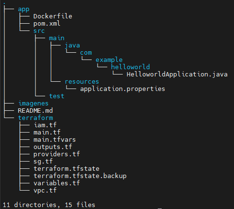
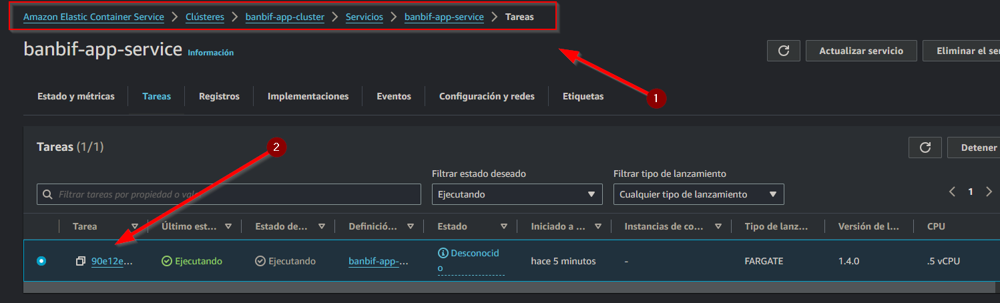
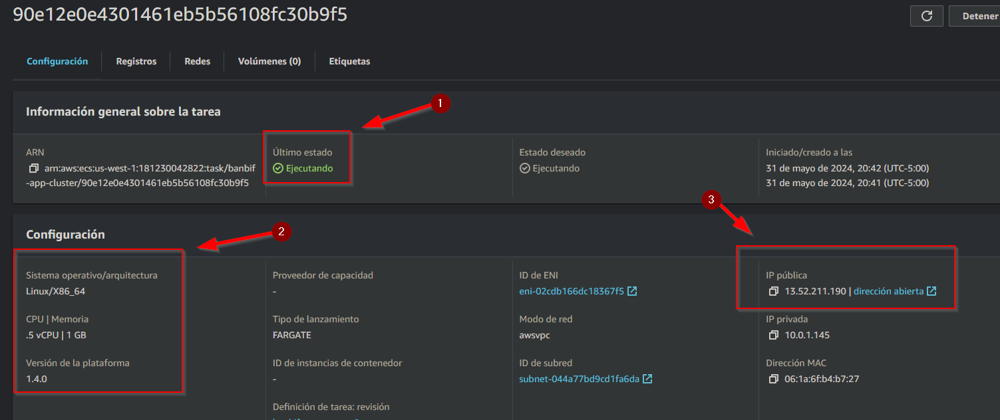
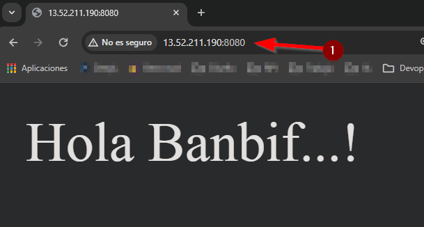

# Reto técnico de Banbif - Devops Senior

Este reto técnico fue desarrollado para el puesto de Devops Senior usando tenologias como Github Actions, Terraform y AWS ECS.

## Objetivo del Proyecto

Desplegar una aplicación web Java en AWS ECS haciendo uso de  Terraform y Github Actions.

## Tecnologías Utilizadas

- Java
- SpringBoot
- Docker
- GitHub Actions
- Terraform
- AWS ECS

## Detalle del Reto Técnico

    1. Crear una aplicación sencilla (HolaMundo o API Crud) con Java.
    2. Compile la aplicación creada con ayuda de Maven, el proceso debe estar dockerizado.
    3. Empaquetar la imagen que contiene el runtime más el código compilado y liberarla en AWS ECR.
    4. Crear un cluster de contenedores en Amazon AWS (ECS o EKS) con ayuda de Terraform.
    5. Desplegar el servicio en el cluster consumiendo la imagen liberada con ayuda de Terraform.
    6. Todo el proceso debe estar orquestado de forma automatizada en un pipeline de GitHub Actions.
    7. La aplicación creada y publicada en un cluster de contenedores debe exponer un endpoint público para validar el funcionamiento.

## Documentación

El proyecto está distribuido de la siguiente forma en el repositorio:


    

   - La carpeta [app](./app) contendrá el codigo fuente de la aplicación java creada con springboot.

   - La carpeta [terraform](./terraform) contendrá la IaC (infrastructure as code) necesaria para realziar la implementación de la infraestructura.

   - La carpeta [imagenes](./imagenes) contedrá las imagenes que se usarán para explciar el funcionamiento de este proyecto.

   - Todo el proceso automatizado de despliegue se encuentra en la ruta [`.github/workflows/pipeline.yml`](./.github/workflows/pipeline.yml)

### Aplicación Java

Este código crea una aplicación Spring Boot simple que expone un endpoint HTTP en la ruta raíz (`/`). Cuando se accede a esta ruta, el servidor responde con el mensaje "Hola Banbif...!". La aplicación se inicia ejecutando el método `main`, que utiliza `SpringApplication.run` para lanzar la aplicación Spring Boot.

```java
package com.example.helloworld;

import org.springframework.boot.SpringApplication;
import org.springframework.boot.autoconfigure.SpringBootApplication;
import org.springframework.web.bind.annotation.RequestMapping;
import org.springframework.web.bind.annotation.RestController;

@RestController
@SpringBootApplication
public class HelloworldApplication {
    
    @RequestMapping("/")
    public String home() {
        return "Hola Banbif...!";
    }

    public static void main(String[] args) {
        SpringApplication.run(HelloworldApplication.class, args);
    }
}
```
- **Controlador REST:** La clase principal está anotada con `@RestController`, lo que indica que manejará solicitudes HTTP.
- **Punto de Entrada de la Aplicación:** La aplicación tiene un método `main` que utiliza `SpringApplication.run` para iniciar la aplicación Spring Boot.
- **Endpoint Principal:** Se define un endpoint en la ruta raíz (`/`) que, cuando es accedido, devuelve el mensaje "Hola Banbif...!".

### Contenerización de la Aplicación

Este Dockerfile define el proceso de construcción y ejecución de la aplicación Spring Boot en un contenedor Docker. Se compone de dos etapas:

```dockerfile
# Etapa 1: construcción de la app
FROM maven:3.8.1-openjdk-17-slim AS build
WORKDIR /app
COPY pom.xml .
RUN mvn dependency:go-offline
COPY src ./src
RUN mvn clean package -DskipTests

# Etapa 2: creación de la imagen para ejecutar la aplicación
FROM openjdk:17.0.1-jdk-slim
WORKDIR /app
COPY --from=build /app/target/helloworld-latest.jar app.jar
ENTRYPOINT ["java", "-jar", "app.jar"]
```
#### Etapa 1: Construcción de la Aplicación

- `FROM maven:3.8.1-openjdk-17-slim AS build`: Utiliza una imagen base de Maven con JDK 17 para construir la aplicación.
- `WORKDIR /app`: Establece el directorio de trabajo en `/app`.
- `COPY pom.xml .`: Copia el archivo `pom.xml` al directorio de trabajo.
- `RUN mvn dependency:go-offline`: Descarga las dependencias de Maven para trabajar sin conexión.
- `COPY src ./src`: Copia el directorio `src` al directorio de trabajo.
- `RUN mvn clean package -DskipTests`: Compila el proyecto y empaqueta la aplicación, omitiendo los tests.

#### Etapa 2: Creación de la Imagen para Ejecutar la Aplicación

- `FROM openjdk:17.0.1-jdk-slim`: Utiliza una imagen base de OpenJDK 17 para ejecutar la aplicación.
- `WORKDIR /app`: Establece el directorio de trabajo en `/app`.
- `COPY --from=build /app/target/helloworld-latest.jar app.jar`: Copia el archivo `helloworld-latest.jar` desde la etapa de construcción al directorio de trabajo y lo renombra como `app.jar`.
- `ENTRYPOINT ["java", "-jar", "app.jar"]`: Define el comando de entrada para ejecutar la aplicación Java.

### Infraestructura como Código 

Para desplegar la aplicación Java en ECS Fargate, se utilizó Terraform. La estructura del despliegue está organizada de la siguiente manera:

- **main.tf**: Define los servicios principales, incluyendo el repositorio privado de Amazon ECR, el clúster de Amazon ECS, la definición de tareas de ECS y el servicio de ECS.
- **providers.tf**: Configura los proveedores necesarios para el despliegue.
- **variables.tf**: Declara todas las variables utilizadas en el despliegue.
- **outputs.tf**: Define los outputs que se generarán tras el despliegue.
- **main.tfvars**: Contiene los valores asignados a las variables declaradas.
- **iam.tf**: Configura las políticas y roles de IAM necesarios.
- **sg.tf**: Define los grupos de seguridad.
- **vpc.tf**: Configura la red VPC utilizada por los recursos de ECS.

Este enfoque modular asegura un despliegue organizado y fácil de mantener.

#### Permisos de IAM

Para permitir que la tarea de ECS extraiga la imagen del contenedor de nuestro repositorio de ECR, necesitamos configurar algunos permisos de IAM. También necesitaremos crear un usuario de IAM para que nuestro flujo de trabajo de GitHub Actions pueda enviar la imagen del contenedor a nuestro repositorio ECR. Estas configuraciones se realizan en el archivo `iam.tf`.

#### Grupo de Seguridad y VPC

Crearemos un grupo de seguridad para que nuestro servicio ECS permita el tráfico desde Internet, definido en el archivo `sg.tf`. También configuraremos la red VPC utilizada por los recursos de ECS, definido en el archivo `vpc.tf`.


```hcl
module "web_access_sg" {
  source      = "terraform-aws-modules/security-group/aws"
  version     = "5.1.0"
  name        = "web-access-sg"
  description = "Security group for web access"
  vpc_id      = module.banbif_app_vpc.vpc_id

  ingress_cidr_blocks = ["0.0.0.0/0"]
  ingress_with_cidr_blocks = [
    {
      description = "Allow application access"
      from_port   = 8080
      to_port     = 8080
      protocol    = "tcp"
      cidr_blocks = "0.0.0.0/0"
    },
  ]

  egress_cidr_blocks = ["0.0.0.0/0"]
  egress_with_cidr_blocks = [
    {
      from_port   = 0
      to_port     = 0
      protocol    = "-1"
      cidr_blocks = "0.0.0.0/0"
    }
  ]

  tags = var.common_tags
}
```


#### Variables
Las variables necesarias se declaran en el archivo `variables.tf`. Usaremos un archivo `main.tfvars` para almacenar nuestros valores de variables, ya que solo tenemos un entorno por ahora.

##### Archivo variables.tf

```hcl
variable "aws_region" {
  description = "AWS region"
}

variable "common_tags" {
  type = map(string)
  default = {
    Terraform = "true"
  }
}

variable "ecs_task_definition_name" {
  description = "ECS task definition name"
}

variable "ecs_container_name" {
  description = "ECS task container name"
}

variable "ecs_cluster_name" {
  description = "ECS cluster name"
}

variable "ecs_service_name" {
  description = "ECS service name"
}
```
##### Archivo main.tfvars

```hcl
aws_region               = "us-west-1"
ecs_task_definition_name = "banbif-app-runner"
ecs_container_name       = "banbif-app"
ecs_cluster_name         = "banbif-app-cluster"
ecs_service_name         = "banbif-app-service"
```

### Despliegue Automatizado con Github Actions

Este pipeline de GitHub Actions automatiza el proceso de implementación de la aplicación Banbif en AWS ECS utilizando Docker, Terraform y Java.

El pipeline se activa en cada push a las ramas `main` o `master`.

#### Pasos del Trabajo (`deploy`)

1. **Checkout del Código**: Se clona el repositorio de código mediante la acción `actions/checkout@v4.1.1`.

2. **Configurar credenciales AWS**: Se utilizan las credenciales de AWS almacenadas de forma segura en los secretos de GitHub para autenticarse en AWS. Esto permite el acceso seguro a los recursos de AWS durante el despliegue.

3. **Iniciar sesión en Amazon ECR**: Se realiza la autenticación en el Amazon Elastic Container Registry (ECR) para poder subir las imágenes Docker creadas durante el proceso de construcción.

4. **Establecer salidas**: Se obtiene el hash corto del commit actual y se almacena como una salida para su uso posterior.

5. **Construir, etiquetar y subir imagen a Amazon ECR**: Se construye la imagen Docker de la aplicación, se le asigna una etiqueta utilizando el hash corto del commit y se sube al ECR. La URI de la imagen resultante se guarda como una salida para su uso posterior.

6. **Descargar definición de tarea**: Se descarga la definición de tarea de ECS actual desde AWS para su posterior actualización.

7. **Actualizar ID de imagen en la definición de tarea de Amazon ECS**: Se actualiza la definición de tarea de ECS con la nueva versión de la imagen Docker creada en el paso anterior.

8. **Desplegar definición de tarea en Amazon ECS**: Se despliega la nueva definición de tarea en el servicio de ECS especificado. Se espera a que el servicio alcance la estabilidad antes de considerar la implementación como completa.

```yml
name: Despliege Banbif

on:
  push:
    branches:
      - main
      - master

jobs:
  deploy:
    runs-on: ubuntu-latest

    steps:
      - name: Checkout code
        uses: actions/checkout@v4.1.1

      - name: Configurar credenciales AWS
        uses: aws-actions/configure-aws-credentials@v4.0.1
        with:
          aws-access-key-id: ${{ secrets.AWS_ACCESS_KEY_ID }}
          aws-secret-access-key: ${{ secrets.AWS_SECRET_KEY }}
          aws-region: ${{ secrets.AWS_REGION }}

      - name: Iniciar sesión en Amazon ECR
        uses: aws-actions/amazon-ecr-login@v2.0.1
        id: login-ecr

      - name: Set outputs
        id: vars
        run: echo "sha_short=$(git rev-parse --short HEAD)" >> $GITHUB_OUTPUT

      - name: Construir, etiquetar y subir imagen a Amazon ECR
        id: build-and-tag-docker-image
        working-directory: ./app
        env:
          ECR_REGISTRY: ${{ steps.login-ecr.outputs.registry }}
          ECR_REPOSITORY: ${{ secrets.AWS_ECR_REPOSITORY }}
          IMAGE_TAG: git-${{ steps.vars.outputs.sha_short }}
        run: |
          docker build -t $ECR_REGISTRY/$ECR_REPOSITORY:$IMAGE_TAG .
          docker push $ECR_REGISTRY/$ECR_REPOSITORY:$IMAGE_TAG
          echo "IMAGE_URI=${{ env.ECR_REGISTRY }}/${{ env.ECR_REPOSITORY }}:${{ env.IMAGE_TAG }}" >> $GITHUB_OUTPUT

      - name: Descargar task definition
        run: |
          aws ecs describe-task-definition \
          --task-definition ${{ secrets.AWS_ECS_TASK_DEFINITION_NAME}} \
          --query taskDefinition \
          --output json > taskDefinition.json

      - name: Actualizar ID de imagen en la definición de tarea de Amazon ECS
        id: update-task-def
        uses: aws-actions/amazon-ecs-render-task-definition@v1.1.3
        with:
          task-definition: taskDefinition.json
          container-name: ${{ secrets.AWS_ECS_CONTAINER_NAME }}
          image: ${{ steps.build-and-tag-docker-image.outputs.IMAGE_URI }}

      - name: Desplegar definición de tarea en Amazon ECS
        id: deploy-ecs
        uses: aws-actions/amazon-ecs-deploy-task-definition@v1.4.11
        with:
          task-definition: ${{ steps.update-task-def.outputs.task-definition }}
          service: ${{secrets.AWS_ECS_SERVICE_NAME}}
          cluster: ${{secrets.AWS_ECS_CLUSTER_NAME}}
          wait-for-service-stability: true
```

Este pipeline automatizado garantiza un proceso seguro y eficiente de despliegue de la aplicación Banbif en la infraestructura de AWS ECS, lo que permite una entrega continua y confiable de la aplicación.

## Uso y Despliegue

A continuación se detallan los pasos para poder probar la automatización del despliegue de la apliación para el reto técnico.

### Clonado del Código.
1. **Clonación del código**:
    - En primer lugar procederemos a clonar el código fuente del proyecto.

        ```console
        # git clone https://github.com/JesquivelR/despliegue-banbif.git
        ```
2. **Borrar contenido de git**:
    - Ya que el proceso de despliegue se realizará en un ambiente diferente se debe eliminar la carpeta .git que contiene toda la configuración del repositorio clonado.

        ```console
        # rm -rf .git/
        ```

3. **Inicializar nuevo contenido de Git**:
    - Procederemos a inicializar la configuración de nuestro repositorio usando el comando:

        ```console
        # git init
        ```
### Creación del repositorio en Github.

    1. Colocar el nombre del repositorio
    2. Colocar una descripción
    3. Configurar como repositorio publico
    4. Quitar check de "Add a README file"
    5. Dar clic en "Create repository"


### Pre-Configuración de Github Actions.

1. **Creación de secretos**: 
    - Debemos crear los respectivos secretos para que el pipeline haga uso de estos, para lo cual debemos ir a nuestro respositorio luego a > Settings > Secrets and Variables > Actions > Repository secrets > New repository secrets y debemos configurar los siguientes secretos con nuestros propios datos:

        - `AWS_ACCESS_KEY_ID`
        - `AWS_ECR_REPOSITORY`
        - `AWS_ECS_CLUSTER_NAME`
        - `AWS_ECS_CONTAINER_NAME`
        - `AWS_ECS_SERVICE_NAME`
        - `AWS_ECS_TASK_DEFINITION_NAME`
        - `AWS_REGION`
        - `AWS_SECRET_KEY`

        

### Creación de Infraestructura con Terraform

1. **Creación de Infraestructura**: 
    - Debemos ubicarnos en la carpeta [terraform](./terraform)  del repositorio clonado y ejecutar los siguientes comandos.

        ```console
        # terraform init
        ```
    - Esperamos a que se descargen todas las dependencias respectivas.

    - Luego debemos crear la infraestructura apoyandonos en el archivo [main.tfvars](./terraform/main.tfvars).

        ```console
        # terraform apply -var-file=main.tfvars
        ```
    - Confirmar la creación de los objetos en caso sea necesario.

### Despliegue de aplicación usando GitHub Actions.

1. **Configuración de repositorio remoto**: 
    - Se debe configurar el repositorio recien creado al cual se subirá el código fuente del proyecto.

        ```console
        # git remote add <repositorio_creado>
        ```
2. **Primer commit y ejecución**:
    - Debemos agregar todos los cambios.

        ```console
        # git add .
        ```
    - Creamos el respectivo commit.

        ```console
        # git commit -m "First Commit"
        ```

    - Subimos el código al repositorio.

        ```console
        # git push origin main
        ```
    - Debido a que el pipeline está configurado para que el despliegue ejecute de forma automática cuando se haga push a la rama origin o main este se ejecutará automáticamente.

    

    - Una vez finalizado se moestrará de la siguiente forma.

    

### Accediendo desde Endpoint Publico.
 Gracias a terraform y a github actions la aplicación ha sido desplegada y se puede acceder a ella desde un endpoint creado en ECS.

    - Acceder a AWS ECS


    - Podrás visualizar el cluster creado.


    - Accedemos al cluster de ECS.


    - Ingresar a la Tarea desplegada.


    - Nos mostrará una IP publica a la cual debemos acceder a través del puerto 8080 ya que así se configuró la infraestructura.


    - Accedemos a la IP con el respectivo puerto.



De esta manera finalizamos el desarrollo del reto técnico.

## Authors

- [@JesquivelR](https://www.github.com/JesquivelR)
